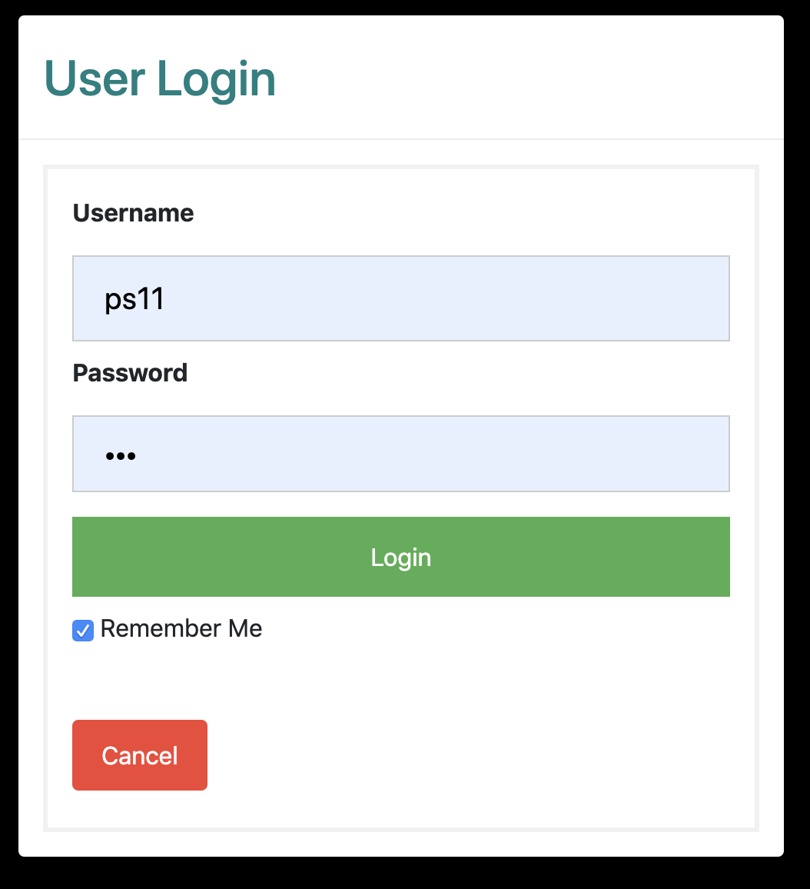

# iPlaylist

# Authors: Sam Levy, Phil Swartz, Jack Ryan
# 2019

Try it out on: 
[Heroku Link](https://iplaylist-2019.herokuapp.com/login)

Overview:

iPlaylist is a fully customizable web application where users can create their own playlists and contribute to the community playlist.

<h1>Layout:</h1>
   
<ol>
<li><strong>A robust login system</strong></li>
   <ul>
      <li>handles user authentication</li>
      <li>includes secure password encryption and decryption methods</li>
   </ul>
   
<li><strong>Front End</strong></li>
   <ul>
      <li>Personalized Playlist:</li>
         <ol>
            <li>gives the user total control to customize a playlist in seconds</li>
            <li>comprised of search, save, and add buttons</li>
            <li>able to play and pause audio right within the app, not reliant on external windows</li>
            <li>can create tags related to a song based on genre, vibes, mood etc...</li>
         </ol>
      
   <li>Community Playlist:</li>
      <ol>
         <li>allows users to see what everyone else likes and dislikes based on our voting feature</li>
         <li>also includes play and pause audio functions</li>
         <li>enables the use of *tags which can be searched for later in the future</li>
      </ol>  
   </ul>
      
<li><strong>Back End</strong></li>
   <ul>
      <li>Sequelize</li>
         <ol>
            <li>used for our database model</li>
            <li>handles all of our CRUD methods</li>
            <li>gets updated on every search, vote, save, add, delete to create a better user experience</li>
         </ol>
   <li>Express</li>
      <ol>
         <li>handles all of our http requests and responses</li>
         <li>backbone of our api and html routing</li>
      </ol>
   <li>API</li>
      <ol>
         <li>utilized the deezer api to randomize song selection</li>
      </ol>
   <li>Handlebars</li>
     <ol>
        <li>templating framework used in both community and personal html</li>
        <li>used for dynamically building our layout</li>
      </ol>
   </ul>
      
 </ol>  
 
  
 <h1>Demo:</h1>

<ol>

   <li>Select new or existing user:</li>
   

    

   <li>Login with username and password (make sure to check remember me!)</li>
   

    

   <li>Navigate to the personal or community page based on your preference</li>
   <ul>
      <li>Personal - if you'd like to create your own playlist</li>
      <li>Commmunity - if you'd like to view other peoples songs</li>
   </ul>
   

    

</ol>

 

Thank you for viewing our code, all feedback, comments, and questions are welcome!

 
   

